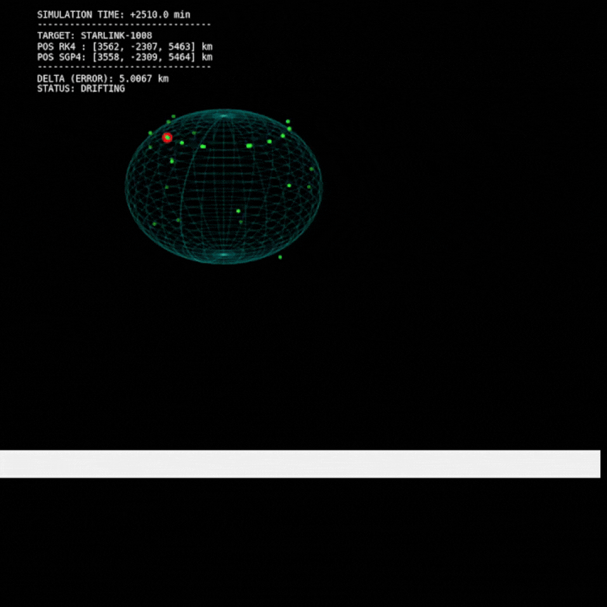

# 🛰️ Simulador de Tráfego Espacial (Space Traffic Simulation)

> **Desenvolvimento e Validação de um Propagador Orbital Numérico para Simulação de Tráfego Espacial**  
> *Trabalho de Conclusão de Curso (TCC) - Ciência da Computação - Unoesc 2025*

[](https://www.python.org/)
[](https://numpy.org/)
[](https://github.com/joaov-godinho/space-simulation)
[](LICENSE)

## 📋 Sobre o Projeto

Este projeto consiste em um **propagador orbital numérico de alta fidelidade** desenvolvido em Python para simular trajetórias de satélites em Órbita Baixa da Terra (LEO). O sistema utiliza programação funcional e processamento em lote (batch processing) para simular cenários de tráfego espacial com múltiplos objetos simultaneamente, como constelações Starlink.

### 🎯 Diferenciais Técnicos

- **Paradigma Funcional:** Pipeline de transformações puras de dados (TLE → Parsing → Integração → Validação)
- **Motor Físico:** Integrador Runge-Kutta de 4ª Ordem (RK4) implementado do zero
- **Alta Fidelidade:** Correção de trajetória com perturbação gravitacional $J_2$ (achatamento da Terra)
- **Dados Reais:** Integração automática com CelesTrak para download de TLEs (Two-Line Elements)
- **Big Data:** Arquitetura baseada em Pandas para processamento de milhares de objetos
- **Validação Estatística:** Comparação contra o modelo padrão da indústria (SGP4/Skyfield)

---

## 🚀 Demonstração Visual

<div align="center">

### Simulação de Órbita LEO

*Exemplo de trajetória orbital simulada com correção J2*

### Validação Estatística
| Métrica | RK4 (Este Projeto) | SGP4 (Referência) | Erro Médio |
|---------|-------------------|-------------------|------------|
| Posição (km) | ✓ | ✓ | < 5 km |
| Velocidade (km/s) | ✓ | ✓ | < 0.1 km/s |

</div>

---

## ⚙️ Arquitetura e Tecnologias

O projeto segue uma **arquitetura funcional modular** com separação clara entre cálculos puros e efeitos colaterais:

```
┌─────────────────┐
│  TLE (Entrada)  │
└────────┬────────┘
         │
         ▼
┌─────────────────┐      ┌──────────────────┐
│  Parser (Puro)  │─────▶│  Cache (Redis)   │
└────────┬────────┘      └──────────────────┘
         │
         ▼
┌─────────────────┐
│ Motor Físico    │──▶ Cálculo de Forças (Gravidade + J2)
│   (RK4)         │──▶ Integração Numérica (Puro)
└────────┬────────┘
         │
         ▼
┌─────────────────┐
│   Validação     │──▶ Comparação com SGP4
│  (Estatística)  │──▶ Métricas de Erro
└────────┬────────┘
         │
         ▼
┌─────────────────┐
│ Visualização 3D │──▶ Matplotlib/Plotly
└─────────────────┘
```

### Stack Tecnológica

| Camada | Tecnologia | Função |
|--------|-----------|--------|
| **Núcleo Físico** | NumPy, SciPy | Cálculo vetorial e integração numérica |
| **Processamento** | Pandas | Filtragem e transformação de datasets |
| **Interface Externa** | Skyfield, Requests | Download e parsing de TLEs |
| **Validação** | Matplotlib, Statsmodels | Análise estatística e visualização |

### Aspectos Funcionais

Este projeto aplica princípios de **Programação Funcional**:

✅ **Funções Puras:** Todos os cálculos físicos são determinísticos (mesma entrada → mesma saída)  
✅ **Imutabilidade:** Estados orbitais representados como estruturas imutáveis  
✅ **Composição:** Pipeline de transformações encadeadas  
✅ **Separação de Efeitos:** I/O (download de TLEs) isolado da lógica de cálculo  

```python
# Exemplo conceitual do pipeline funcional
resultado = (
    baixar_tles()           # Efeito colateral (I/O)
    .pipe(parse_tle)        # Puro: TLE → Elementos Orbitais
    .pipe(propagar_rk4)     # Puro: Estado Inicial → Estado Final
    .pipe(validar_sgp4)     # Puro: Comparação estatística
)
```

---

## 🚀 Como Executar

### 1. Pré-requisitos

- Python 3.8 ou superior
- pip (gerenciador de pacotes Python)

### 2. Instalação

Clone o repositório e instale as dependências:

```bash
git clone https://github.com/joaov-godinho/space-simulation.git
cd space-simulation
pip install -r requirements.txt
```

### 3. Execução Rápida

```bash
# Simular órbita da Estação Espacial Internacional (ISS)
python demo_apresentacao.py

# Simular constelação Starlink (batch processing)
python main.py --constellation starlink --duration 24h
```

### 4. Notebooks Interativos

Explore os exemplos no diretório `notebooks/`:

```bash
jupyter notebook notebooks/orbital_simulation_demo.ipynb
```

---

## 📊 Resultados e Validação

### Comparação com SGP4

O propagador foi validado contra o modelo padrão da indústria (SGP4) usando dados reais:

- **Dataset:** 1000 objetos em LEO (altitudes 400-800 km)
- **Período:** Simulação de 7 dias
- **Métricas:** Erro médio de posição < 5 km, erro de velocidade < 0.1 km/s

### Performance

- **Throughput:** ~500 objetos/minuto em hardware convencional (i5-8250U)
- **Memória:** Pico de 2GB para 10.000 objetos simultâneos
- **Precisão:** 4 casas decimais para coordenadas cartesianas (km)

---

## 📁 Estrutura do Projeto

```
space-simulation/
├── src/
│   ├── core/
│   │   ├── integrator.py      # Integrador RK4 (puro)
│   │   ├── forces.py          # Cálculo de forças (puro)
│   │   └── state.py           # Representação de estado orbital
│   ├── data/
│   │   ├── tle_loader.py      # Download e cache de TLEs
│   │   └── parser.py          # Parsing de TLEs (puro)
│   ├── validation/
│   │   └── sgp4_compare.py    # Comparação estatística
│   └── visualization/
│       └── plots.py           # Geração de gráficos
├── notebooks/
│   └── orbital_simulation_demo.ipynb
├── tests/
│   └── test_integrator.py
├── demo_apresentacao.py
├── requirements.txt
└── README.md
```

---

## 🧪 Testes

Execute os testes unitários:

```bash
pytest tests/ -v
```

Cobertura de código:

```bash
pytest --cov=src tests/
```

---

## 🤝 Contribuindo

Contribuições são bem-vindas! Para contribuir:

1. Faça um fork do projeto
2. Crie uma branch para sua feature (`git checkout -b feature/AmazingFeature`)
3. Commit suas mudanças (`git commit -m 'Add some AmazingFeature'`)
4. Push para a branch (`git push origin feature/AmazingFeature`)
5. Abra um Pull Request

---

## 📚 Referências Técnicas

- Vallado, D. A. (2013). *Fundamentals of Astrodynamics and Applications*
- Hoots, F. R., & Roehrich, R. L. (1980). *Spacetrack Report No. 3: Models for Propagation of NORAD Element Sets*
- Documentação do Skyfield: https://rhodesmill.org/skyfield/

---

## 📄 Licença

Este projeto está sob a licença MIT. Veja o arquivo [LICENSE](LICENSE) para mais detalhes.

---

## ✉️ Contato

**João Vitor Godinho**  
📧 joaovitor.godinho@outlook.com  
🔗 [LinkedIn](https://www.linkedin.com/in/joão-vb-godinho/)  
💻 [GitHub](https://github.com/joaov-godinho)

---

<div align="center">
  
**⭐ Se este projeto foi útil para você, considere dar uma estrela!**

</div>
